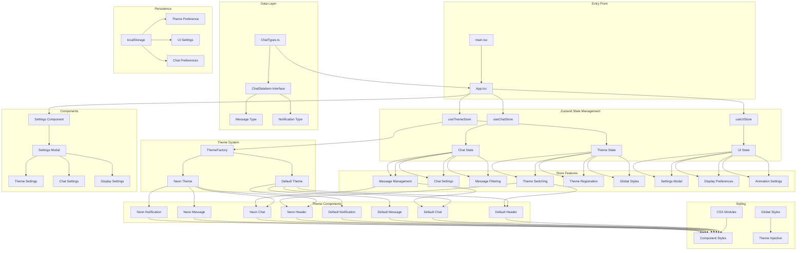
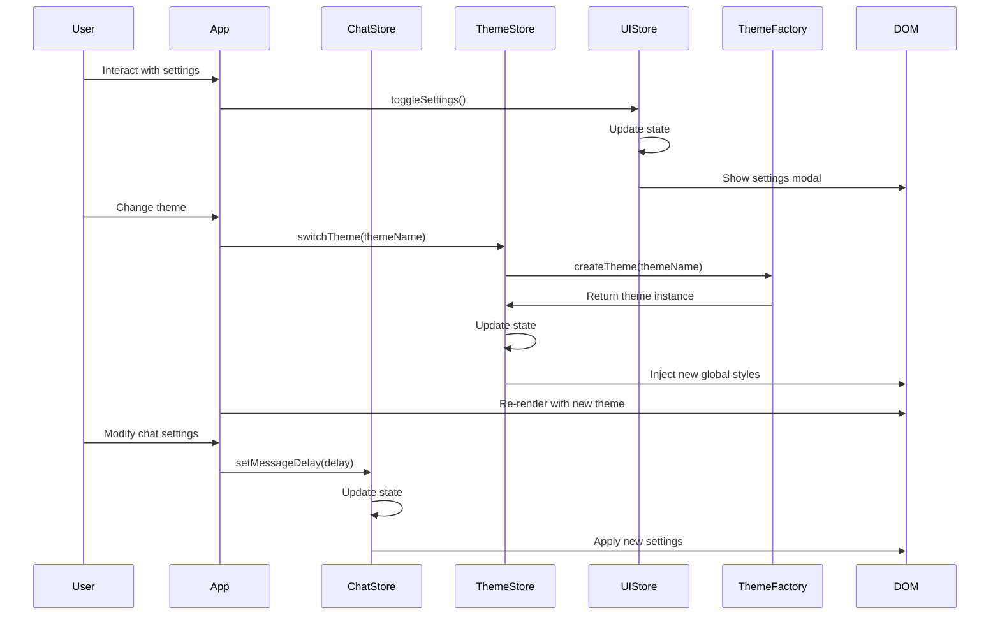

# TChat - React Chat Application Architecture

## Overview

TChat is a modern React-based chat application designed for streaming platforms, featuring a sophisticated theming system and real-time message display. The application is built with TypeScript, Vite, and follows a modular component architecture with a factory pattern for theme management and Zustand for state management.

## Architecture Review

### 🏗️ **Architecture Pattern: Factory + Zustand Pattern**

The application implements a **Factory Pattern** combined with **Zustand** for state management, creating a highly extensible and maintainable architecture with centralized state management.

### 📁 **Project Structure Analysis**

```
src/
├── store/                     # Zustand state management
│   ├── index.ts              # Store exports
│   ├── chatStore.ts          # Chat state management
│   ├── themeStore.ts         # Theme state management
│   ├── uiStore.ts            # UI state management
│   └── useThemeInitializer.ts # Theme initialization hook
├── components/
│   └── Settings/             # Settings component
│       ├── Settings.tsx      # Settings modal
│       └── Settings.module.css
├── themes/                    # Theme system (Factory Pattern)
│   ├── ThemeInterface.ts     # Core theme interfaces
│   ├── ThemeFactory.ts       # Theme factory implementation
│   ├── default/              # Default theme implementation
│   └── neon/                 # Neon theme implementation
├── types/
│   └── ChatTypes.ts          # TypeScript type definitions
├── App.tsx                   # Main application component
└── main.tsx                  # Application entry point
```

### 🎨 **Theme System Architecture**

The theme system is the core architectural feature, implementing:

1. **Factory Pattern**: `ThemeFactory` manages theme creation and registration
2. **Zustand State Management**: `themeStore` provides global theme state management
3. **Component Interface**: Each theme implements a consistent interface
4. **Dynamic Loading**: Themes can be registered/unregistered at runtime

### 🔧 **Key Components Analysis**

#### **App.tsx (Main Application)**
- **Role**: Application orchestrator and state integration
- **Responsibilities**:
  - Zustand store integration
  - Message simulation with configurable timers
  - Theme integration via `useThemeStore` hook
  - Component rendering coordination
  - Settings modal management

#### **Zustand Stores**
- **Pattern**: Centralized State Management
- **Responsibilities**:
  - **chatStore**: Message management, chat settings, message filtering
  - **themeStore**: Theme switching, theme registration, global styles
  - **uiStore**: UI preferences, settings modal, display options

#### **ThemeFactory.ts**
- **Pattern**: Singleton Factory Pattern
- **Responsibilities**:
  - Theme registration and management
  - Dynamic theme creation
  - Fallback mechanism (default theme)
  - Theme lifecycle management

#### **Theme Components (Header, Chat, Message, Notification)**
- **Pattern**: Strategy Pattern
- **Responsibilities**:
  - Theme-specific rendering logic
  - CSS module integration
  - Consistent interface implementation
  - UI settings integration

### 🎯 **Data Flow Architecture**

```
User Interaction → Zustand Store → State Update → Component Re-render → DOM
     ↓
LocalStorage ← Persistence ← Store Middleware ← State Changes
```

### 🔄 **State Management**

- **Zustand Stores**: Centralized state with persistence and devtools
- **Chat State**: Messages, message index, chat settings, auto-scroll
- **Theme State**: Current theme, available themes, theme switching
- **UI State**: Settings modal, display preferences, animations
- **Persistent State**: Theme preference, UI settings, chat preferences

### 🎨 **Styling Architecture**

- **CSS Modules**: Scoped styling per component
- **Global Styles**: Theme-specific global CSS injection
- **Dynamic Styling**: Runtime theme switching with style replacement
- **Responsive Design**: Flexbox-based layout system
- **UI Settings**: Font sizes, compact mode, animation controls

## Architecture Diagram



## Component Interaction Flow



## Strengths of Current Architecture

### ✅ **Modularity**
- Clear separation of concerns with dedicated store modules
- Each store manages specific domain state
- Easy to add new stores without modifying existing code

### ✅ **Extensibility**
- Factory pattern allows dynamic theme registration
- Interface-based design ensures consistency across themes
- Zustand provides flexible state management

### ✅ **Type Safety**
- Comprehensive TypeScript interfaces
- Strong typing for store state and actions
- Compile-time error checking

### ✅ **Performance**
- CSS Modules for optimized styling
- Efficient theme switching with style injection
- Zustand's selective re-rendering
- Minimal re-renders with proper state management

### ✅ **Maintainability**
- Consistent code structure across stores
- Clear naming conventions
- Separation of business logic from presentation
- Centralized state management

### ✅ **Developer Experience**
- Zustand devtools integration
- Persistent state across sessions
- Easy debugging with store inspection
- Hot reload support

## Areas for Improvement

### 🔧 **Potential Enhancements**

1. **Performance Optimization**
   - Implement virtual scrolling for large message lists
   - Add message memoization with React.memo
   - Optimize theme switching performance
   - Add message pagination

2. **Feature Extensions**
   - Add message filtering and search
   - Implement user authentication
   - Add real-time WebSocket integration
   - Add message reactions and emojis

3. **Testing**
   - Add unit tests for Zustand stores
   - Implement integration tests
   - Add visual regression testing
   - Add store state testing

4. **Accessibility**
   - Add ARIA labels and roles
   - Implement keyboard navigation
   - Add screen reader support
   - Add high contrast themes

5. **Advanced State Management**
   - Add middleware for logging
   - Implement undo/redo functionality
   - Add optimistic updates
   - Add offline support

## Technical Stack

- **Framework**: React 19.1.0
- **Language**: TypeScript 5.8.3
- **Build Tool**: Vite 6.3.5
- **State Management**: Zustand 4.5.0
- **Styling**: CSS Modules
- **Patterns**: Factory Pattern, Zustand Pattern, Strategy Pattern
- **Persistence**: localStorage via Zustand persist middleware
- **DevTools**: Zustand devtools integration

## Conclusion

The TChat application demonstrates a well-architected React application with a sophisticated theming system and robust state management. The combination of Factory and Zustand patterns creates a highly extensible and maintainable codebase. The modular design allows for easy theme additions and modifications while maintaining type safety and performance.

The Zustand implementation provides several advantages over the previous Context-based approach:
- **Better Performance**: Selective re-rendering and minimal overhead
- **Developer Experience**: Built-in devtools and persistence
- **Type Safety**: Strong TypeScript integration
- **Flexibility**: Easy to add middleware and computed values
- **Testing**: Simplified testing with store isolation

The architecture successfully separates concerns, provides clear interfaces, and implements modern React patterns effectively. The theming system is particularly well-designed, offering both flexibility and consistency across different visual themes, while the state management provides a solid foundation for future feature additions.
